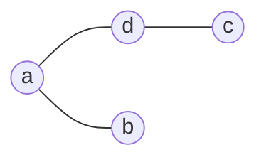
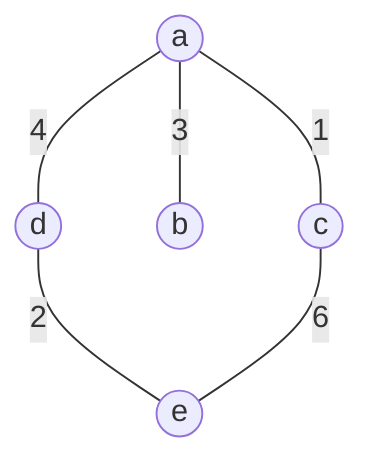
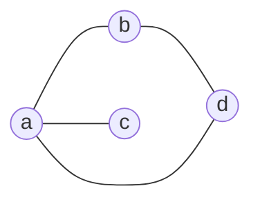
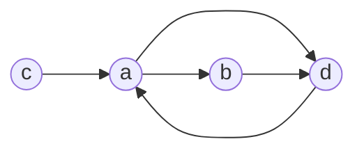
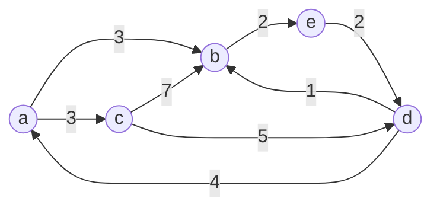

##### 一、图的定义

###### 1.图及基本术语

 &ensp;图(graph) 是一种网状数据结构，图是由非空的顶点集合和一个描述顶点之间关系的集合组成，其形式化定义如下：  

&emsp;Graph = (V,E)

V = \{x|x $\in$ 某个数据对象 \}

E = \{<u,v>|P(u,v)^(u,v$\in$V)\}

&ensp;V是具有相同特性的数据元素的集合，V中的数据元素通常为 *顶点(Vertex)*,E是两个顶点之间关系的集合。P(u,v)表示u和v之间特定的关联属性。

&ensp; 若<u,v>$\in$E,则<u,v>表示从顶点u到顶点v的一条狐，并称u为弧尾或起始点，称v为弧头或终止点，此时图中的顶点之间连线是有方向的，这样图称为有向图。

&ensp;若<u,v>$\in$E,则必有<v,u>$\in$E,即关系E是对称的，此时可以使用无序对(u,v)来代替两个序列对，它表示顶点u和顶点v之间的一条边，此时图中顶点之间的连线是没有方向的，这种图称为无向图。

- 简单图

&emsp;不含特殊边(某条边的两个顶点是同一个顶点)的图称为简单图。对于简单图而言，图中所有的边自然构成一个集合，并且每条边的两个顶点均不相同。  

- 邻接点

&emsp;对于无向图G=(V,E),如果边(u,v)$\in$E,则称顶点u与顶点v互为邻接点。

&emsp;对于有向图G=(V,E),如果边<u,v>$\in$E,则称顶点u邻接到顶点v，顶点v邻接自顶点u，或称v为u的邻接点，u为v的逆邻接点

- 顶点的度、入度、出度

&emsp;顶点的*度*是指依附于某顶点v的边数，通常记为TD(v)。

&emsp;在有向图中，顶点v的入度是指以顶点为终点的边的数目，记为ID(v);顶点v出度是指以顶点v为起始点的边的数目，记为OD(v)。对于有向图有TD(v)=ID(v)+OD(v);在无向图中每条边都可以看成出边，也可以看成入边，此时TD(v)=ID(v)=OD(v).

&emsp;对于任何图G=(V,E)中，|E|=($\sum$TD(Vi))/2

- 完全图、稠密图、稀疏图

&emsp;假设图中顶点个数为n，边数为m。

&emsp;在无向图中当每个奠定都与其余n-1个顶点邻接时，图的边数达到最大，此时图中每两个顶点之间都存在一条无向边，边数m为n个顶点任意取出2个的组合数，即m=n(n-1)/2

&emsp;有向图m=n(n-1)

&emsp;有n(n-1)/2条边的无向图称为无向完全图；有n(n-1)条边的有向图称为有向完全图。有很少边的图称为稀疏图，反之边较多的图称为稠密图。

子图

&emsp;设图G=(V,E)和G'=(V',E')。

&emsp;&emsp;如果V'$\in$V且E'$\in$E,则G'是G的一个子图；

&emsp;&emsp;如果V'=V且E'$\in$,则G'是G的一个生成子图；

&emsp;所谓图中的一条通路或路径，就是由m+1个顶点与m条边交替构成的一个序列$\rho$={v0,e1,v1,e2,....,em,vm}，m$\geq$0,且ei=(vi-1,vi),1$\leq$i$\leq$m。路径上边的数目称为路径长度，计作|$\rho$|.

&emsp;长度为|$\rho$|$\geq$1的路径，若路径第一个顶点与最后一个顶点相同，则称之为环路或环。

&emsp;如果组成路径$\rho$的所有顶点各不相同，则称之为简单路径；如果在组成环的所有顶点中，除首尾顶点外均各不相同，则称该环为简单环路。如果组成路径$\rho$的所有边都是有向边，且ei均是从vi-1指向vi,1$\leq$i $\leq$ m,则称$\rho$为有向路径。

&emsp;在有向图G中，若从顶点s到顶点v有一条通路，则称v是从s可达的，对于顶点s，从s可达的所有顶点所组成的集合，称作s在G中对应的**可达分量**。

- 连通性与连通分量

&emsp;在无向图中，如果从一个顶点vi到另一个顶点vj(i$\neq$j)有路径，则称顶点vi和vj是连通的。如果图中任意两顶点vi、vj都是连通的，则称该图是**连通图**.

**连通分量**:是指无向图的极大连通子图。显然任何连通图的连通分量只有一个，即本身。而非连通图有多个连通分量，各个连通分量之间是分离的，没有任何边相连。

&emsp;在有向图中若图中任意一对顶点vi和vj(i$\neq$j)均有一条从顶点vi到另一顶点vj的路径。也有从vj到vi的路径，则称该有向图是**强连通图**。有向图的极大强连通子图称为**强连通分量**。显然任何强连通图的强连通分量只有一个,即本身。而非强连通图有多个强连通分量，各个强连通分量内部的任意顶点之间是互通的。

- 无向图的生成树

&emsp;对于无向图G=(V,E)。如果G是连通图，则G的生成树，是G的一个极小连通生成子图。

&emsp;图G的生成树必定包含图G的全部n个顶点，以及足以构成一课树的n-1条边。在生成树种添加任意一条属于原图中的边必定会产生回路，因为生成树本身是连通的，新添加的边使其所依附的两个顶点之间有了第二条路径。若生成树中减少任意一条边，则必然成为非连通的，因为生成树是极小连通生成子图。

&emsp;一棵有n个顶点和小于n-1条边，则是非连通图。如果它有多于n-1条边，则一定有环路。

- 权与网

&emsp;在实际应用中，图不但需要表示元素之间是否存在某种关系，而且图的边往往与具有一定实际意义的数有关，即每条边都有与它相关的实数，称为**权**。这些权值可以表示从一个顶点到另一个顶点的距离或消耗等信息。这种边上具有权值得图称为带权图或网。

###### 2.抽象数据类型

ADT定义  略

##### 二、图的存储方法

###### 1.邻接矩阵

&emsp;图的**邻接矩阵**表示法是使用数组来存储图结构的方法，也被称为**数组表示法**。

它采用两个数组来表示图：一个是用于存储所有顶点信息的一维数组，另一个是用于存储图中顶点之间关联关系的二维数组，这个关联关系数组也被称为邻接矩阵。

&emsp;假设图G=(V,E)有n个顶点，即V={v0,v1,.....,vn-1},则表示G中各顶点关联关系的为一个n$\times$n的矩阵A，矩阵的元素为:

$$ A[i,j]= \begin{cases} 1, & \text {<u,v>或(u,v)$\in$E} \\ \infty, & \text{反之} \end{cases} $$

$ \text{横/竖a,b,c,d}\begin{bmatrix} \infty & 1&1&1 \\ 1 & \infty &\infty&1 \\1 & \infty&\infty&\infty \\1 & 1 & \infty & \infty \\ \end{bmatrix} $

$ \text{横/竖a,b,c,d}\begin{bmatrix} \infty & 1&\infty&1 \\ \infty & \infty &\infty&1 \\1 & \infty&\infty&\infty \\1 & \infty & \infty & \infty \\ \end{bmatrix} $

&emsp;此种表示形式也可以推广至带权图，若G是一个有n个顶点的带权图，则它的邻接矩阵是具有如下性质的n$\times$n的矩阵A:

$$ A[i,j]= \begin{cases} Wij, & \text {<u,v>或(u,v)$\in$E} \\ \infty, & \text{反之} \end{cases} $$

$ \text{横/竖a,b,c,d,e}\begin{bmatrix} \infty & 3&3&\infty &\infty \\ \infty & \infty &\infty&\infty&2 \\\infty & 7&\infty&5 & \infty \\4 & 1 & \infty & \infty &\infty \\ \infty & \infty & \infty & 2 & \infty \\ \end{bmatrix} $

###### 2.邻接表

&emsp;**邻接表** 是图的一种链式存储方法，在邻接表中对于图G的每个顶点vi建立一个单链表，将所有邻接于vi的顶点vj链成一个单链表，并在表头附设一个表头结点，这个单链表就称为顶点的vi的邻接表。

&emsp;在邻接表中共有两种结点结构，分别是边表结点和表头结点。每个结点由三个域组成，其中邻接点域(adjvex)指示与顶点vi邻接的顶点在图中的位置，链域(nextedge)指向下一条边所在的结点，数据域(info)存储和边有关的信息

| 边表结点 |      |          |
| -------- | ---- | :------: |
| Adjvex   | Info | Nextedge |

######3.双链式存储结构

虽然邻接表是图的一种很有效的存储结构，在邻接表中容易求得顶点和边的各种信息，但是删除顶点和边比较复杂。双链式存储结构可以解决这个问题。

&emsp;首先将顶点和边都抽象成一个独立的类；

&emsp;其次所有顶点和边分别存储在链接表中；

&emsp;在顶点中有3个重要的指针域：顶点位置域，邻接边域，逆邻接表域。其中顶点位置域指向顶点所在顶点链接表中所在的结点。

&emsp;在边中有5个重要的指针域：第一顶点域、第二顶点域、第一边表位置域、第二边表位置域、边位置域。在有向图中，第一顶点位置域指向该边的起始顶点在顶点表中的位置，第二顶点域指向该边的终止顶点在顶点表中的位置；如果是无向图，则分别指向边的两个顶点在顶点表中的位置。在有向图中，第一边表位置域指向边在其起始点的出边表位置，第二边表位置域指向边在其终止点的入边表中的位置；如果是无向图，则这两个域分别指向边在其第一、第二顶点的邻接边表中的位置。边位置域指向边在边表中的位置。  

##### 三、图的遍历

###### 1.深度优先搜索

&emsp;深度优先搜索的基本方法是: 从图中某个顶点v出发，访问此顶点，然后依次从v的未被访问的邻接点出发深度优先遍历图，直至图中所有和v有路径想通的顶点都被访问到；若此时图中尚有顶点未被访问，则另选图中一个未曾被访问的顶点作起始点，重复上述过程，直至图中所有顶点都被访问到为止。

&emsp;广度优先搜索：假设从图中某顶点v出发，在访问了v之后依次访问v的各个未曾访问过的邻接点，然后分别从这些邻接点出发依次访问它们的邻接点，并使“先被访问的顶点的邻接点”先于“后被访问的顶点的邻接点”先被访问，直至图中所有顶点的邻接点都被访问到。若此时图中尚有顶点未被访问，则另选图中一个未曾被访问的顶点作起始点，重复上述过程，直至图中所有顶点都被访问到为止。

##### 四、图的连通性

###### 1.无向图的连通分量和生成树

&emsp;在对无向图进行遍历时，对于连通图，仅需从图中任何一个顶点出发，进行深度优先搜索或广度优先搜索，便可访问到图中所有顶点。对于非连通图，则需从多个顶点出发进行搜索，而每次从一个新的起始点进行搜索的过程中得到的顶点访问序列恰为其各个连通分量中顶点集。

&emsp;设E是连通图G中所有边的集合，则从图中任意一个顶点出发遍历时，必定将E分成两个子集：Et和Eb,其中Et是遍历图过程中经历的边的集合；Eb是剩余边的集合。显然Et和图中所有顶点一起构成连通图G的极小连通子图，即图G的生成树。并且由深度优先搜索得到的为深度优先搜索生成树；由广度优先搜索得到的为广度优先搜索生成树。

###### 2.有向图的强连通分量

&emsp;在无向图中从某个顶点v出发深度优先搜索或广度优先搜索，就可以得到无向图中包含v在内的一个连通分量，然后从有向图中某个顶点s出发进行深度优先搜索或广度优先搜索，只能得到顶点s的可达分量，不一定能够得到包含s在内的强连通分量。

&emsp;对于任何有向边e=<u,v>,称R(e)=<v,u>为e的镜像边,即R(e)的起点就是e的终点。对于任何有向图G=(V,E),称R(E)={R(e)|e$\in$E}为E的镜像边集，R(G)为G的镜像图。

&emsp;为构造图G=(V,E)中包含顶点s的强连通分量有如下方法：求出顶点s在图G中的可达分量与顶点s在R(G)中的可达分量的交集；而在有向图中求顶点s的可达分量，只需要从s出发进行深度优先搜索或广度优先搜索即可。

###### 3.最小生成树

&emsp;对于一个连通网来说，生成树不同，每棵树的代价也可能不同，我们把代价最小的生成树称为图的最小生成树。

&emsp;尽管最小生成树必然存在，但是不一定唯一。

&emsp;假设已知一个无向连通图G=(V,E),其边加权函数为w:E->R,构造最小生成树的基本思想是：每步形成最小生成树的一条边；算法设置了边集合A，初始时为空，该集合一直是某最小生成树的子集。在每步决定是否把边(u,v)添加到集合A中，其添加条件是A与{(u,v)}的并集仍然是最小生成树的子集。称这样的边为A的安全边，通过上述过程找到的|V|-1条边最后返回集合A时，A必然是一棵最小生成树。