##### 一、排序的基本概念

&emsp;**排序**的功能是将一个数据元素的任意序列，重新排列称一个按关键字有序的序列。其确切的定义为：

&emsp;假设有n个数据元素的序列{R1,R2,...,Rn},其相应关键字的序列是{K1,K2,...,Kn},通过排序要求找出下标1,2,....,n的一种排列p1,p2,...,pn,使得相应关键字满足如下的非递减(或非递增)关系

Kp1$\leq$Kp2$\leq$...$\leq$Kpn

这样，就得到一个按关键字有序的纪录序列: {Rp1,Rp2,...,Rpn}。

&emsp;根据排序时待排序的数据元素数量不同，使得排序过程中涉及的存储器不同，可以排序方法分为两类。一类是整个排序过程在内存储器中进行，称为内部排序；另一类是由待排序元素数量太大，以至于内存储器无法容纳全部数据，排序需要借助外部存储设备才完成，这类排序称为外部排序。

&emsp;如果在待排序的序列中存在多个具有相同关键字的元素。假设Ki=Kj(1$\leq$i$\leq$n,1$\leq$i$\leq$n,i$\neq$j),若在排序之前的序列中Ri在Rj之前，经过排序后得到的序列中Ri仍然Rj之前，则称所用的排序方法是**稳定**的；否则,当相同关键字元素的前后关系在排序中发生变化，则称所用的排序方法是**不稳定**的。

##### 二、插入类排序

&emsp;插入类型排序的基本排序思想是: 逐个考察每个待排序元素，将每一个新元素插入到前面已经排好序的序列中适当的位置上，使得新序列仍然是一个有序序列。

&emsp;主要有三种:直接插入排序、折半插入排序和希尔排序。

###### 1.直接插入排序

&emsp;直接插入排序是一种最简单的插入排序方法，它的基本思想是: 仅有一个元素的序列总是有序的，因此对n个纪录的序列，可从第二个元素开始直到第n个元素逐个向有序序列中执行插入操作，从而得到n个元素按关键字有序的序列。

###### 2.折半插入排序

&emsp;在直接插入排序的基础之上，通过不断二分有序序列来确定插入位置，即搜索插入位置的方法可以使用折半查找实现。

######3.希尔排序

&emsp;希尔排序又称为“缩小增量排序”，其基本思想是首先将待排序的元素分为多个子序列，使得每个子序列的元素个数相对较少，对各个子序列分别进行直接插入排序，待整个待排序序列基本有序后，再对所有元素进行一次直接插入排序。

&emsp;排序过程如下:

​       1.选择一个步长序列t1,t2,...,tk,其中ti>tj(i<j),tk=1;

​       2.按步长序列个数k，对待排序元素序列进行k趟排序；

​       3.每趟排序，根据对应的步长ti,将待排序列分割成ti个子序列，分别对各子序列进行直接插入排序。

##### 三、交换类排序

###### 1.冒泡排序

&emsp;基本思想是首先将n个元素中的第一个和第二个进行比较，如果两个元素的位置为逆序，则交换两个元素的位置，如此类推，直到比较第n-1个元素和第n个元素为止。

###### 2.快速排序

&emsp;通过一个枢轴元素将n个元素的序列分为左、右两个子序列Ll和Lr，其中子序列Ll中的元素均比枢轴元素小，而子序列Lr中的元素均比枢轴元素大，然后对左右子序列的排序过程直到子序列中只包含一个元素时结束，此时左、右子序列由于只包含一个元素则自然有序。

&emsp;用分治法的三个步骤来描述快速排序的过程如下:

​      1.划分步骤:通过枢轴元素x将序列一分为二，且左子序列的元素均小于x，右子序列的元素均大于x；

​      2.治理步骤：递归的对左、右子序列排序；

​      3.组合步骤：无

&emsp;对待排序列进行划分的做法是：使用两个指针low和high分别指向待划分序列r的范围，去low所指元素为枢轴，即privot = r[low]。划分首先从high所指位置的元素起向前逐一搜索到比privot小的元素，并将其设置到low所指的位置；然后从low所指位置的元素起向后逐一搜索到第一个比privot大的元素，并将其设置到high所指的位置；不断重复上述两步直到low==high位置，最后将privot设置到low和high共同指向的位置。

##### 四、选择类排序

&emsp;选择排序的基本思想是：每一趟从n-i+1(i=1,2,...,n)个元素中选取一个关键字最小的元素作为有序序列中第i个元素。

###### 1.简单选择排序

&emsp;基本思想：第一趟，从n个元素中找出关键字最小的元素与第一个元素交换；第二趟，再从第二元素开始的n-1个元素中再选出关键字最小的元素与第二个元素交换，直到整个序列按关键字有序。

###### 2.树型选择排序

&emsp;树型选择排序也称为锦标赛排序。其基本思想是：先把待排序的n个元素两两进行比较，取出较小者，若轮空则直接进入下一轮比较；然后在$\lceil$n/2$\rceil$个较小者中，采用同样方法进行比较，再选出较小者；如此反复，直到选出关键字最小的元素为止。这个过程可以使用一棵具有n个结点的完全二叉树来表示，最终选出的关键字最小的元素就是这颗二叉树的根节点。

&emsp;在输出关键字最小的元素后，为选出次小关键字，可以将最小关键字元素所对应的叶子结点的关键字设置为$\infty$,然后从该叶子结点起逆行向上，将所经过的结点与其兄弟进行比较修改从该叶子结点到根结点上各结点的值，则根结点的值即为次小关键字。重复上述过程，直到所有元素全部输出为止，则得到按关键字有序的序列。

&emsp;缺点：使用了较多的辅助空间，以及和$\infty$进行多于比较

###### 3.堆排序

&emsp;堆的概念。堆的定义为：n个元素的序列{k1,k2,...,kn},当且仅当满足下列关系时，称之为堆。

①$$\begin{cases} k_i \leq k_{2i} \\ k_i \leq k_{2i+1} \end{cases}$$  或 ② $$\begin{cases} k_i \geq k_{2i} \\ k_i \geq k_{2i+1} \text {其中i=1,2,...., $\lfloor$ n/2 $\rfloor$  } \end{cases}$$

若满足条件①，则称为小顶堆，若满足条件②，则称为大顶堆。

&emsp;如果将序列\{k1,k2,...,kn}对应为一维数组，且序列中元素的下标与数组中下标一致，即数组中小标为0的位置不存放数据元素，此时该序列可看成是一棵完全二叉树，则堆的定义说明，在对应的完全二叉树中非终端节点的值均不大于或不小于其左右孩子结点的值。由此，若堆是大顶堆，则堆顶元素-完全二叉树的根-必为序列中n个元素的最大值；反之，若是小顶堆，则堆顶元素必为序列中n个元素的最小值。

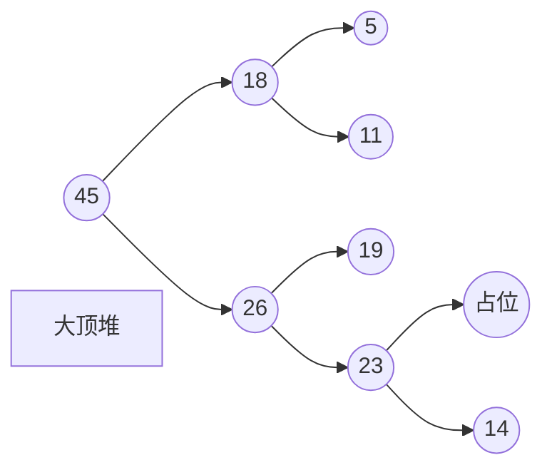

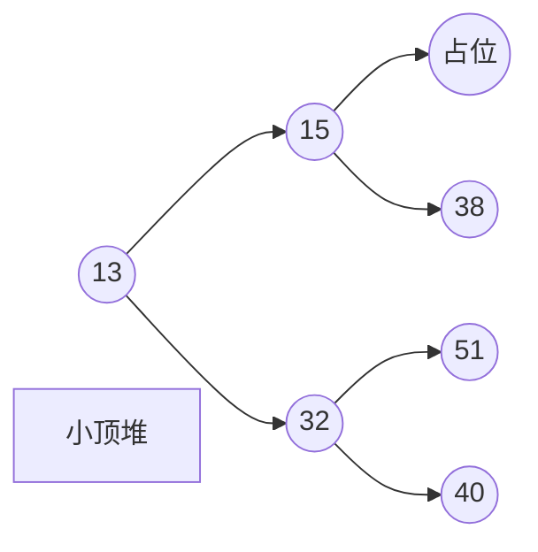

&emsp;设有n个元素，欲将其按关键字排序。可以首先将这n个元素按关键字建成堆，将堆顶元素输出，得到n个元素中关键字最大或最小的元素。然后，再将剩下的n-1个元素重新建成堆，再输出堆顶元素，得到n个元素中关键字次大或次小的元素。如此反复执行，直到最后剩一个元素，则可以得到一个有序序列，这个排序过程称之为堆排序。

&emsp;在实现堆排序时需要解决两个问题:

​     1.如何将n个元素的序列按关键字建成堆；

​      2.输出堆顶元素后，怎样调整剩余n-1个元素，使其按关键字成为一个新堆。

&emsp;设有一个具有m个元素的堆，输出堆顶元素后，剩下m-1个元素。具体调整方法是：首先，将堆底元素（最后一个元素）送入堆顶，此时堆被破坏，其原因仅是根结点不满足堆的性质，而根结点的左右子树仍是堆。然后，将根结点与左、右子女中较大或较小的进行交换，则右子树堆被破坏，且仅右子树的根结点不满足堆的性质。继续对不满足堆性质的子树进行上述交换操作，直到叶子结点，则堆被重建。我们称这个自根结点到叶子结点的调整过程为筛选。

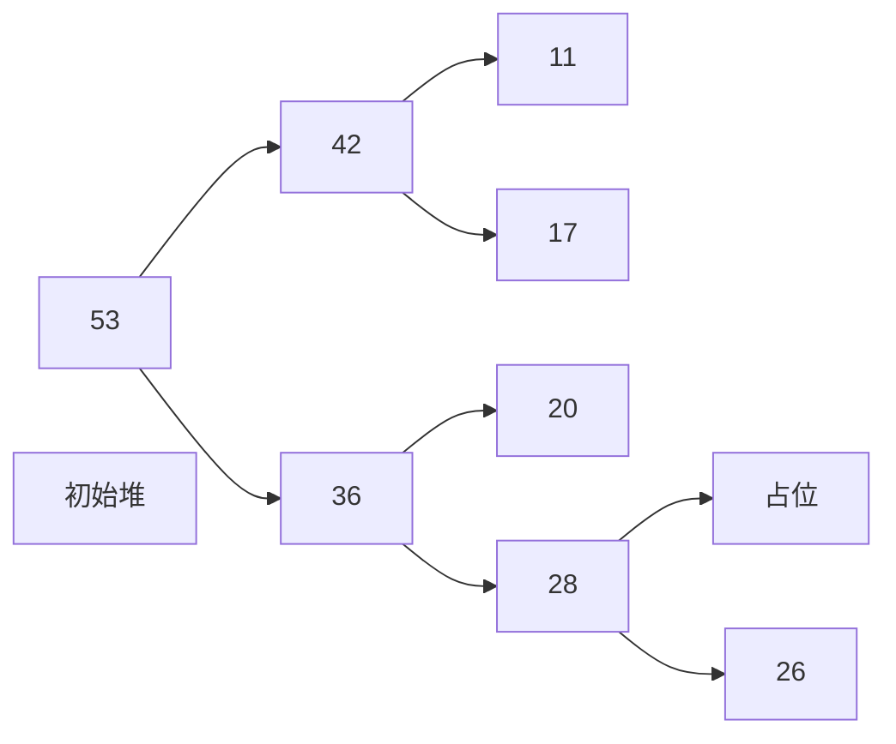

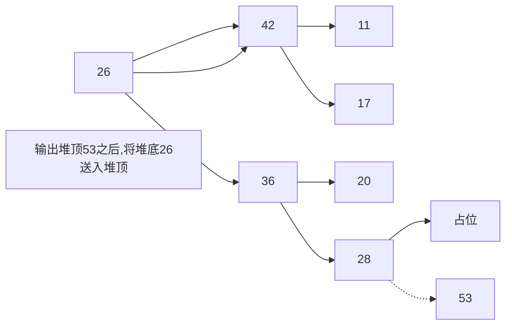

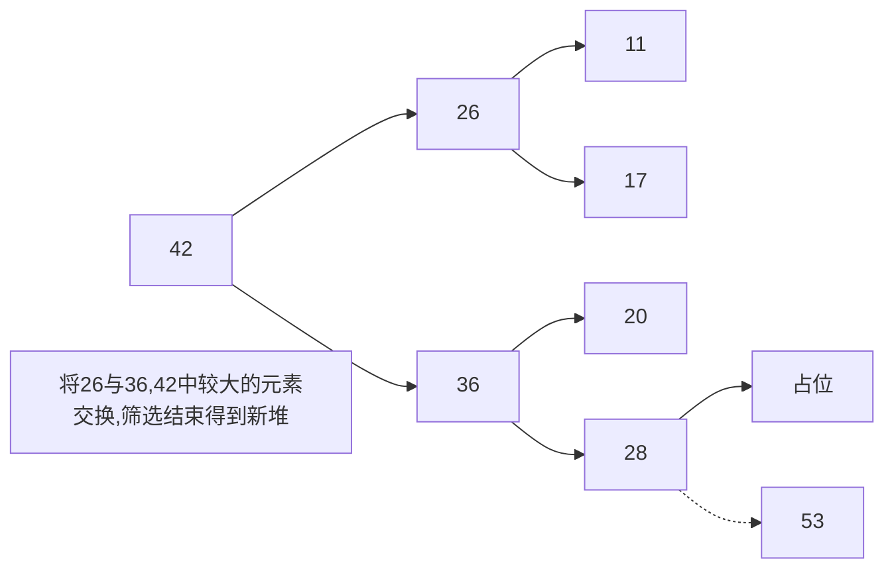

&emsp;由一个元素的初始序列构造一个堆，实际上建堆的方法就是逐层向上对每个非终端结点进行一次筛选即可。

> 待排序初始序列     {28，26，17，36，20，42，11，53}

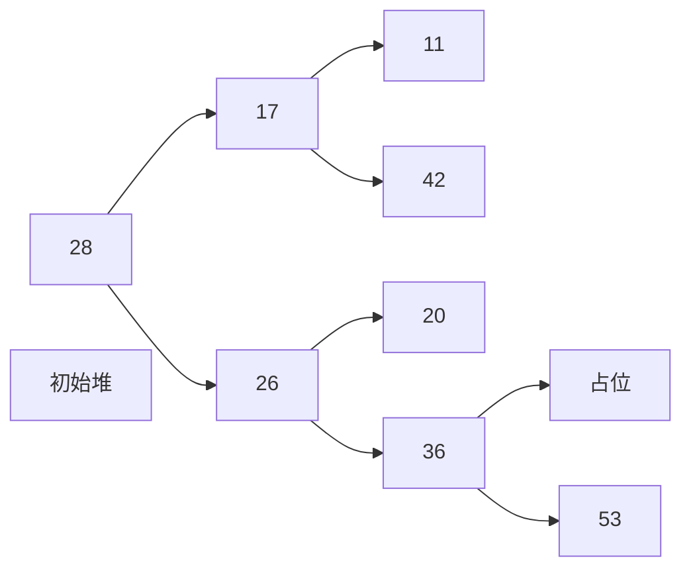

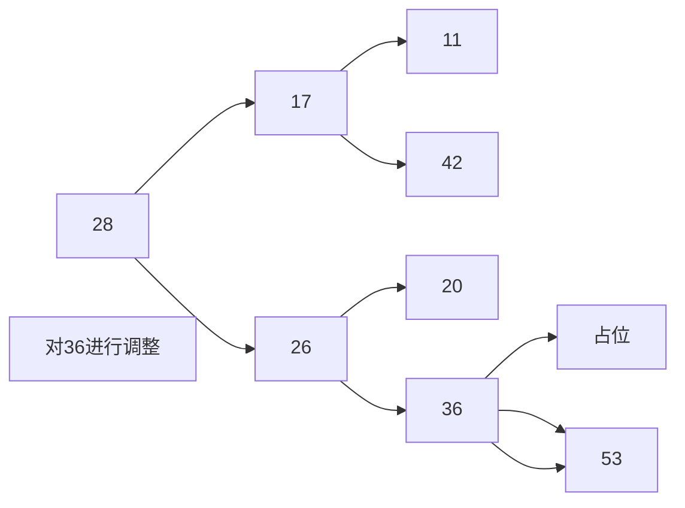

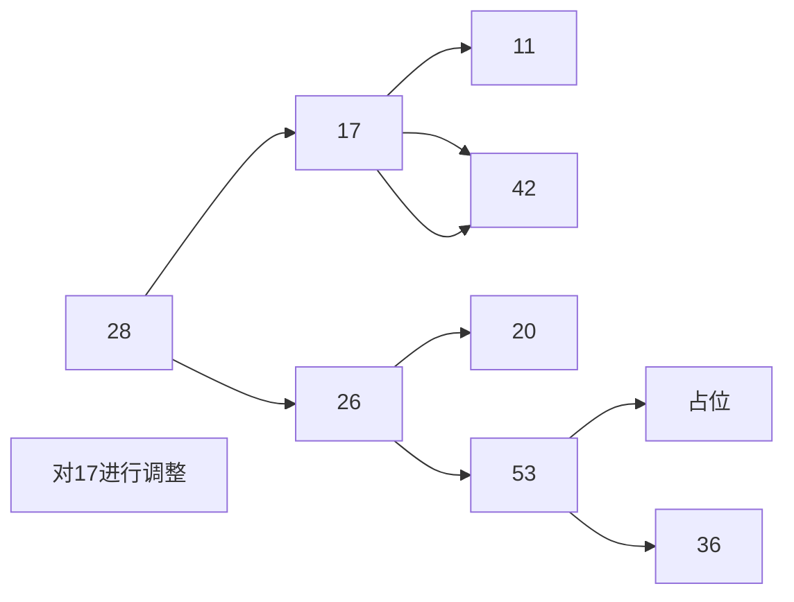

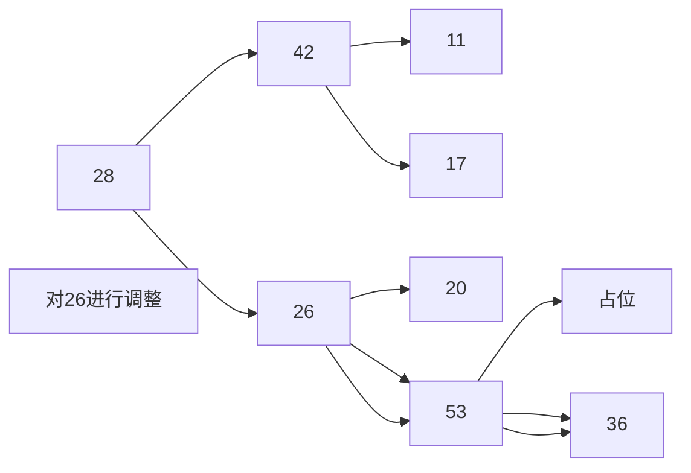

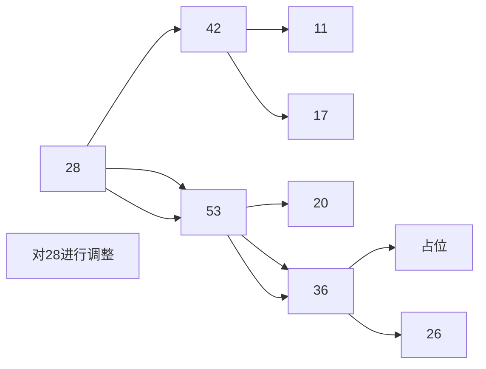

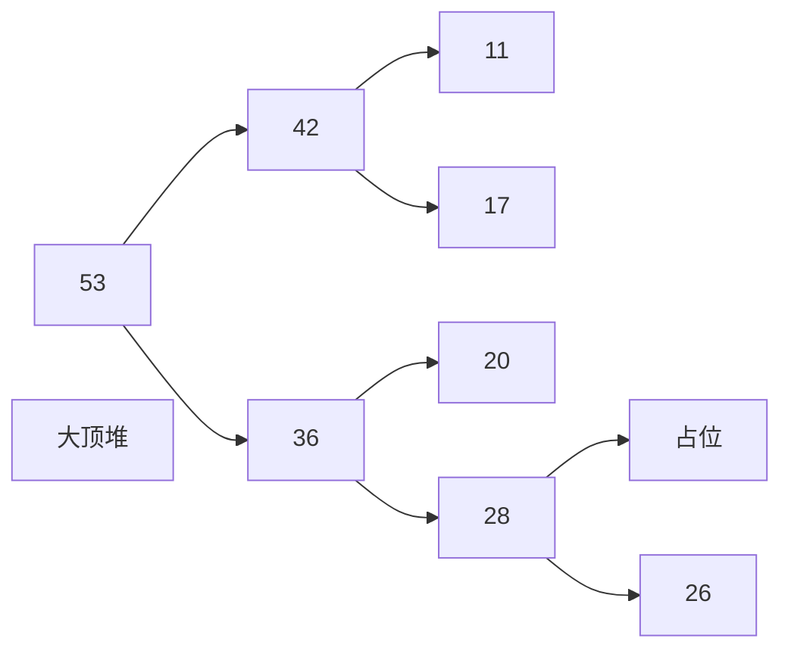

##### 五、归并排序

&emsp;归并排序是另一类不同的排序方法，这种方法是运用分治法解决问题的典型范例。

&emsp;归并排序的基本思想是基于合并操作，即合并两个已经有序的序列是容易的,不论这两个序列是顺序存储还是链式存储，合并操作都可以在O(m+n)时间内完成(假设两个有序表的长度分别为m和n)。为此，由分治法的一般设计步骤得到归并排序的过程为:

​        1.划分:将待排序的序列划分为大小相等或大致相等的两个子序列；

​        2.治理：当子序列的规模大于1时，递归排序子序列，如果子序列规模为1则成为有序序列；

​        3.组合: 将两个有序的子序列合并为一个有序序列。

&emsp;归并排序中一个核心的操作是将一个序列中前后两个相邻的子序列合并为一个有序序列

##### 六、基于比较的排序的对比

| 排序方法     | 平均时间复杂度   | 最坏时间复杂度   | 空间复杂度 | 稳定性 |
| ------------ | ---------------- | ---------------- | ---------- | ------ |
| 直接插入排序 | O(n2) | O(n2) | O(1)       | 稳定   |
| 冒泡排序     | O(n2) | O(n2) | O(1)       | 稳定   |
| 快速排序     | O(nlogn)         | O(n2) | O(logn)    | 不稳定 |
| 简单选择排序 | O(n2) | O(n2) | O(1)       | 不稳定 |
| 堆排序       | O(nlogn)         | O(nlogn)         | O(1)       | 不稳定 |
| 归并排序     | O(nlogn)         | O(nlogn)         | O(n)       | 稳定   |

##### 七、在线性时间内排序

###### 1.计数排序

&emsp;计数排序是一个非基于比较的线性时间排序算法。它对输入的数据有附加的限制条件:

​      1.输入的线性表的元素属于有限偏序集S;

​       2.设输入的线性表长度为n，|S|=k(k表示集合S中元素的总数目为k),则k=O(n)。在这两个条件下，计数排序的复杂性为O(n)。

&emsp;计数排序算法的基本思想是对于给定的输入序列中的每一元素x，确定该序列中值小于x的元素的个数。一旦确定了这个信息，就可以将x直接存放到最终输出序列的正确位置。

&emsp;假设输入序列L的长度为n，L={L0,L1,...,Ln-1};线性表的元素属于有限偏序集S，|S|=k且k=O(n),S={S0,S1,...,Sk-1};则计数排序算法可以描述如下:

1. 扫描整个集合S，对每一个Si $\in$ S,找到在序列L中小于等于Si的元素的个数C(Si);
2. 扫描整个序列L，对L中的每一个元素Li,将Li放在输出线性表的第C(Li)个位置上，并将C(Li)减1.

###### 2.基数排序

&emsp;基数排序是一种“低位优先”的排序方法，它的基本思想是通过反复的对子关键字排序来完成排序。假设元素r[i]的关键字为keyi,keyi是由d位十进制数组成，即keyi=ki1ki2...kid,则每一位可以视为一个子关键字，其中ki1是最高位,kid是最低位，每一位的值都在0-9的范围内，此时基数rd = 10。如果ki1是由d个英文字母组成，则基数rd = 26。

&emsp;排序时先按最低位的值对元素进行初步排序，在此基础上再按次低位的值进行进一步排序。依次类推，由低位到高位，每一趟都是在前一趟的基础上，根据关键字的某一位对所有元素进行排序,直到最高位,这样完成了计数排序的全过程。