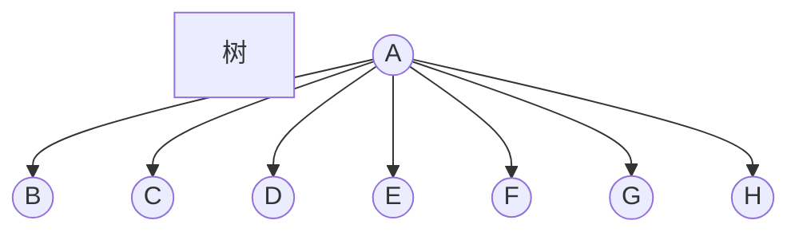
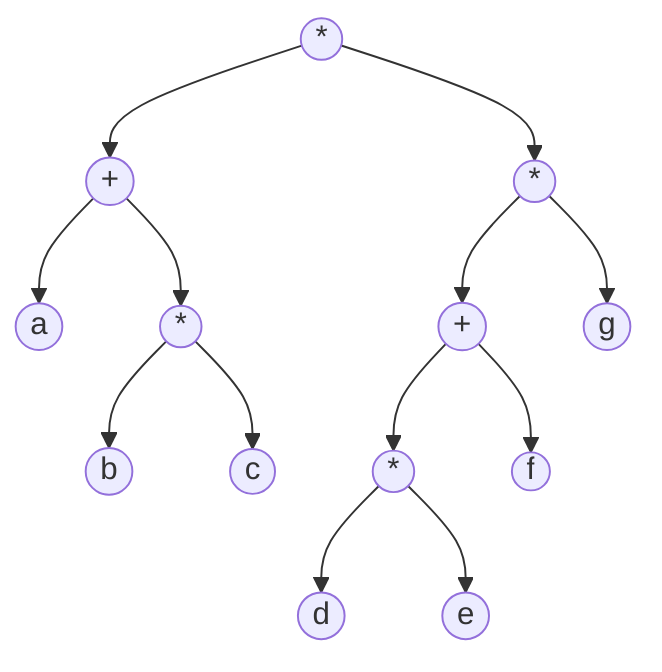

#### 一、概念

&emsp;**树**是一些节点的集合。这个集合可以是空集；若不是空集，则树由称作根的节点$r$以及0个或多个非空的树$T_1,T_2,...,T_k$组成，这些子树中每一棵的根都被来自根$r$的一条有向的边所连结。

&emsp;每一棵树的根叫作根$r$的儿子，而$r$是每一棵树的根的**父亲**。

&emsp;一棵树是$N$个节点和$N-1$条边的集合，其中的一个节点叫作根。



&emsp;没有儿子的节点称为树叶，具有相同父亲的节点为兄弟。

##### 1.树的实现

```java
class TreeNode{
  Object element;
  TreeNode firstChild;
  TreeNode nextSibling;
}
```

##### 2.树的遍历及应用

&emsp;磁盘目录，先序遍历、中序遍历、后序遍历


#### 二、二叉树

&emsp;二叉树是一棵树，其中每个节点都不能有多于两个的儿子。

&emsp;二叉查找树平均深度$O(log N)$。最坏情况$N-1$。

##### 1.实现

```java
class BinaryNode{
  Object element;
  BinaryNode left;
  BinaryNode right;
}
```

##### 2.例子：表达式树

&emsp;表达式树的树叶是操作数，而其他的节点为操作符。

&emsp;表达式(a+b\*c)+((d\*e+f)\*g)



####三、查找树ADT-二叉查找树

&emsp;二叉查找树的性质是，对于树中的每个节点$X$，它的左子树中所有项的值小于$X$中的项，而它的右子树中所有项的值大于$X$中的项。

#### 四、AVL树

&emsp;AVL树是带有平衡条件的二叉查找树。这个平衡条件必须要容易保持，而且它保证树的深度须是$O(log N)$。每个节点的左子树和右子树的高度最多差1的二叉查找树。

&emsp;不平衡的四种情况:

​     1.对当前节点的左二子的左子树进行一次插入

​     2.对当前节点的左二子的右子树进行一次插入

​     3.对当前节点的右儿子的左子树进行一次插入

​     4.对当前节点的右儿子的右子树进行一次插入

&emsp;解决不平衡：

​      1.单旋；2.双旋

#### 五、伸展树

&emsp;**伸展树**保证从空树连续$M$次对树的操作最多花费$O(M log N)$时间。

&emsp;当$M$次操作的序列总的最坏情形运行时间为$O(Mf(N))$时，我们就说它的摊还运行时间为$O(f(N))$。因此一棵伸展树每次操作的摊还代价是$O(logN)$。

&emsp;伸展树基于这样的事实：对于二叉查找树来说，每次操作最坏情形时间$O(N)$并不坏，只要它相对不常发生就行。

&emsp;伸展树的基本想法是，当一个节点被访问后，它就要经过一系列AVL树的旋转被推到根上。


##### 六、标准库中的集合与映射

##### 1.关于set接口

&emsp;Set接口代表不允许重复元素的Collection。由接口SortedSet给出的一种特殊类型的Set保证其中的各项处于有序的状态。保持以有序状态的Set的实现是TreeSet。

##### 2.关于Map接口

&emsp;Map是一个接口，代表由关键字以及它们的值组成的一些项的集合。关键字必须是唯一的，值不必唯一。SortedMap接口的一种实现是TreeMap类。

##### 3.TreeSet类和TreeMap类的实现

&emsp;Java要求TreeSet和TreeMap支持基本的add、remove和contains操作以对数最坏情形时间完成。因此基本的实现方法就是平衡二叉查找树。一般来说，并不适用AVL树，而是红黑树


